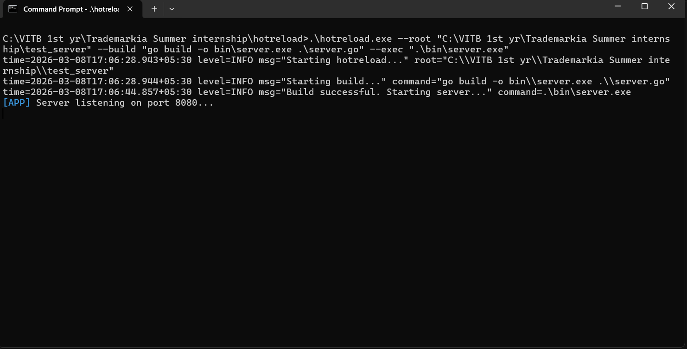
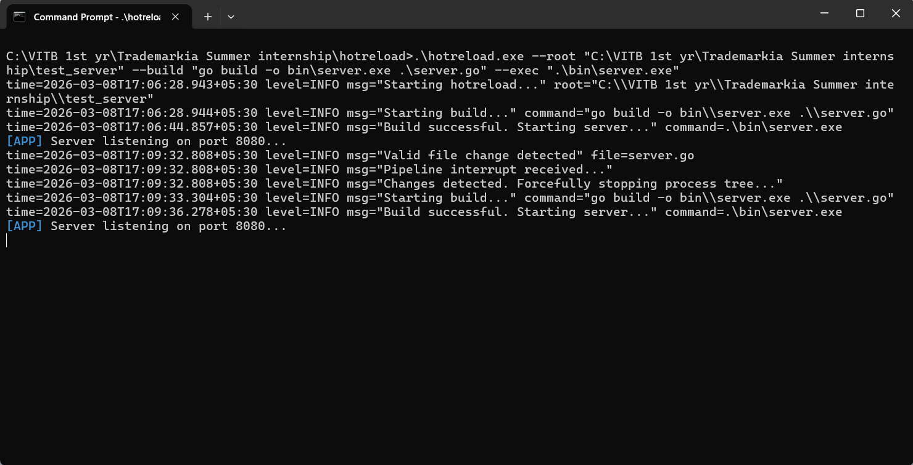

# 🔥 Go Hot-Reload CLI

A high-performance, industry-ready hot-reload tool for Go applications. 

Unlike standard file-watching scripts, this tool is designed to handle edge cases that frequently crash local development environments, such as OS file-watcher limits, orphaned child processes (zombies), and rapid-fire editor saves.

## 🌟 Key Architectural Decisions (Why this isn't just a basic script)

### 1. Process Tree Annihilation (No Zombie Ports)
The most common point of failure for hot-reloaders is leaving "stubborn" child processes attached to ports (resulting in `bind: Only one usage of each socket address is permitted`). 
* **The Fix:** This tool utilizes Windows-native Process Group creation (`syscall.CREATE_NEW_PROCESS_GROUP`) and `taskkill /T /F` to guarantee the parent process and **all** of its children are forcefully terminated before a restart occurs. 

### 2. Pre-Filtered File Watching (O(1) Scalability)
Standard `fsnotify` implementations recursively add every directory to the OS watcher, which immediately crashes on large monorepos with massive `.git` or `node_modules` folders.
* **The Fix:** This tool implements a custom `filepath.WalkDir` interceptor that evaluates paths *before* adding them to the watch list. By returning `fs.SkipDir` on bloat folders, it uses a fraction of system memory and starts up instantly. It also dynamically watches newly created folders at runtime.

### 3. Context-Driven Pipeline Coordination
To handle rapid-fire `Ctrl+S` saves from editors, this tool abandons simple boolean flags or Mutexes in favor of Go's `context.Context`. 
* **The Fix:** When a new file change occurs, the current build context is aggressively canceled mid-flight. It doesn't wait for a stale build to finish; it kills the process tree instantly and starts fresh.

### 4. Custom Stream Interceptor (Clean Logs)
Standard hot-reloaders pipe `exec.Cmd` output directly to the terminal, causing system logs and server logs to mangle together concurrently.
* **The Fix:** This tool implements a custom `io.Writer` that intercepts the child process's stdout/stderr byte stream, buffers it until a newline, and prepends a color-coded `[APP]` or `[ERR]` tag. This guarantees thread-safe, beautiful log separation.

## 🚀 How to Run

Compile the tool:
```bash
go build -o hotreload.exe .
```

### Run it against your project folder. You must provide the --root, --build, and --exec flags:
```dos
.\hotreload.exe --root "C:\path\to\your\project" --build "go build -o bin\server.exe .\main.go" --exec ".\bin\server.exe"
```

## ⚙️ Supported File Extensions

The tool employs smart extension filtering so that saving documentation (like a `README.md` or `.txt` file) doesn't accidentally trigger a backend recompilation. 

It specifically watches for changes to the following file types:
* `.go`
* `.json`
* `.env`
* `.yaml` / `.yml`
* `.html`
* `.tmpl`

## 📸 Demonstration

**1. Server Running (Before Changes):**


**2. Hot-Reload in Action (Changes Detected):**


**3. Server Restarted (After Changes):**
